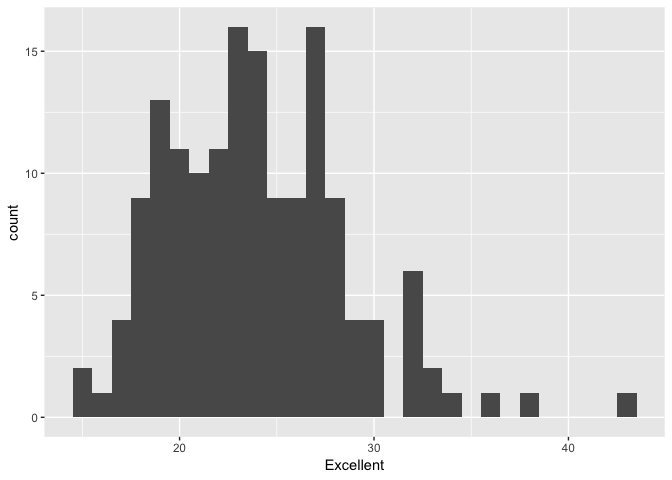
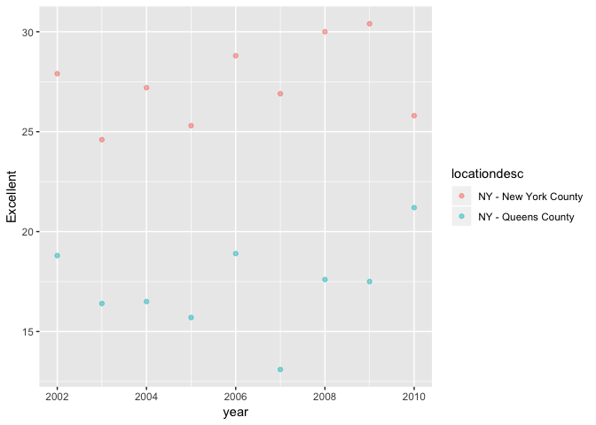

p8105\_hw2\_hn2339
================
Haowei Ni
2018/9/30

``` r
library(tidyverse)
```

    ## ─ Attaching packages ──────────────────────── tidyverse 1.2.1 ─

    ## ✔ ggplot2 3.0.0     ✔ purrr   0.2.5
    ## ✔ tibble  1.4.2     ✔ dplyr   0.7.6
    ## ✔ tidyr   0.8.1     ✔ stringr 1.3.1
    ## ✔ readr   1.1.1     ✔ forcats 0.3.0

    ## ─ Conflicts ────────────────────────── tidyverse_conflicts() ─
    ## ✖ dplyr::filter() masks stats::filter()
    ## ✖ dplyr::lag()    masks stats::lag()

``` r
library(dplyr)
```

Question 1
==========

``` r
NYC_Subway <- read_csv("data /NYC_Subway.csv") %>%
  # clean the name to lower case 
  janitor::clean_names() %>%
  # remove the unwante columns 
  select(-division, -exit_only, -staffing, -staff_hours, -free_crossover, -north_south_street, -east_west_street, -corner, -station_location, -entrance_location, -entrance_longitude, -entrance_latitude) %>%
  # convert the entry variable from "YES NO" to "TRUE FALSE"
  mutate(entry = recode(entry, "YES" = TRUE, "NO" = FALSE)) 
```

    ## Parsed with column specification:
    ## cols(
    ##   .default = col_character(),
    ##   `Station Latitude` = col_double(),
    ##   `Station Longitude` = col_double(),
    ##   Route8 = col_integer(),
    ##   Route9 = col_integer(),
    ##   Route10 = col_integer(),
    ##   Route11 = col_integer(),
    ##   ADA = col_logical(),
    ##   `Free Crossover` = col_logical(),
    ##   `Entrance Latitude` = col_double(),
    ##   `Entrance Longitude` = col_double()
    ## )

    ## See spec(...) for full column specifications.

There are totally 20 variables in this data set. Retain line, statation name, station longitude/latitude, route1~11, entrance type, entry, vending and ADA compliance. Step 1 is change the capital letter to lower case. Step 2 is remove all the unwanted columns. Step 3 is change the entry variable (YES or NO) to logical variable (TRUE or FLASE). The data is not tidy yet.

``` r
 #find the distinct station, . keep_all = TRUE keep all other data 
distinct_station = distinct(NYC_Subway, station_name, line, route1, .keep_all = TRUE) 
   dim(distinct_station)
```

    ## [1] 466  20

``` r
# find out ADA compliant and the proportion 
ADA_compliant = filter(distinct_station, ada == TRUE)
   dim(ADA_compliant)
```

    ## [1] 84 20

``` r
Without_vending = filter(distinct_station, vending == "NO", entry == TRUE)
   dim(Without_vending)
```

    ## [1]  5 20

``` r
Without_vending_no = filter(distinct_station, vending == "NO")
   dim(Without_vending_no)
```

    ## [1]  9 20

There are totally 450 distinct stations both by name and by line. There are totally 75 stations are ADA compliant. The proportion is 5/9 = 55.6%

``` r
# use gather function to make route number and name to be distinct variables
reformat_data = gather(NYC_Subway, key = route_number, value =route_name, route1:route11 )
# use distinct to find unique stations serve A train 
   distinct_AA = distinct(reformat_data, station_name, line, route_name, .keep_all = TRUE) 
   distinct_A = filter(distinct_AA, route_name == "A")
   dim(distinct_A) 
```

    ## [1] 60 11

``` r
# filter out the non-ADA 
ADA = filter(distinct_A, ada == TRUE)
   dim(ADA) 
```

    ## [1] 17 11

There are totally 60 stations. There are 17 ADA compliant.

Question 2
==========

``` r
library(readxl)
Mr_TrashWheel = read_excel("data /HealthyHarborWaterWheelTotals2017-9-26.xlsx", range = "A2:N258") %>%
  janitor::clean_names() %>%
  filter(!is.na(dumpster)) %>%
  mutate(sports_balls = as.integer(round(sports_balls, 0)))
  Mr_2016 = filter(Mr_TrashWheel, year == 2016)
```

``` r
library(readxl)
Precipation_2016 = read_excel("data /HealthyHarborWaterWheelTotals2017-9-26.xlsx", sheet = 4, range = "A2:B15") %>%
  janitor::clean_names() %>%
  filter(!is.na(total)) %>%
  mutate(Year = "2016")
Precipation_2017 = read_excel("data /HealthyHarborWaterWheelTotals2017-9-26.xlsx", sheet = 3, range = "A2:B15") %>%
  janitor::clean_names() %>%
  filter(!is.na(total)) %>%
  mutate(Year = "2017")
Precipation = bind_rows(Precipation_2016, Precipation_2017) %>%
  mutate(month = month.name[month])
  P2017 = filter(Precipation, Year == 2017)
```

The dimension of the Mr\_TrashWheel is 215, 14. There are total 14 variables. Dumpster, volumes and weight, homes powered and other kinds of trashes are the key variables. The dimension of the Precipation is 22, 3 There are total 3 variables. Month, total precipation and year. The median number of sports balls in a dumpster in 2016 is 26 The total precipation in 2017 is 59.86 \#Question 3

``` r
# install.packages("devtools")
devtools::install_github("p8105/p8105.datasets")
```

    ## Skipping install of 'p8105.datasets' from a github remote, the SHA1 (21f5ad1c) has not changed since last install.
    ##   Use `force = TRUE` to force installation

``` r
library(p8105.datasets)
    data(brfss_smart2010) 
    BRFSS = janitor::clean_names(brfss_smart2010) %>%
    filter(topic == "Overall Health") %>%
    select(-c(class, topic, question, sample_size, confidence_limit_low:geo_location)) %>%
    spread(key = response, value = data_value) 
    Scatter_plot = filter(BRFSS, locationdesc == "NY - New York Country" | locationdesc == "NY - Queens Country")
    destination = distinct(BRFSS, locationdesc, .keep_all = TRUE) 
    state = distinct(BRFSS, locationabbr, .keep_all = TRUE)
    most = tail(names(sort(table(BRFSS$locationabbr))), 1)
    Excellent_2002 = filter(BRFSS, year == "2002") %>%
    # 
    mutate(proportion = (Excellent + `Very good` ) / (Excellent + Fair + Good + Poor + `Very good`))
#make the histogram 
    ggplot(Excellent_2002, aes(x = Excellent)) +
      geom_histogram()
```

    ## `stat_bin()` using `bins = 30`. Pick better value with `binwidth`.

    ## Warning: Removed 2 rows containing non-finite values (stat_bin).



``` r
#make the scatterplot 
    Scatter = filter(BRFSS, locationdesc == "NY - New York County" | locationdesc == "NY - Queens County")
    ggplot(Scatter, aes(x = year, y = Excellent)) + 
      geom_point(aes(color = locationdesc), alpha = 0.5)
```

 The number of unique destination is 404. The number of unique state is 51. So every state is represented. The most state which observed most is NJ. The median of 2002 excellent is 23.6
